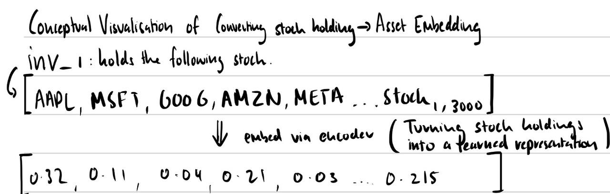
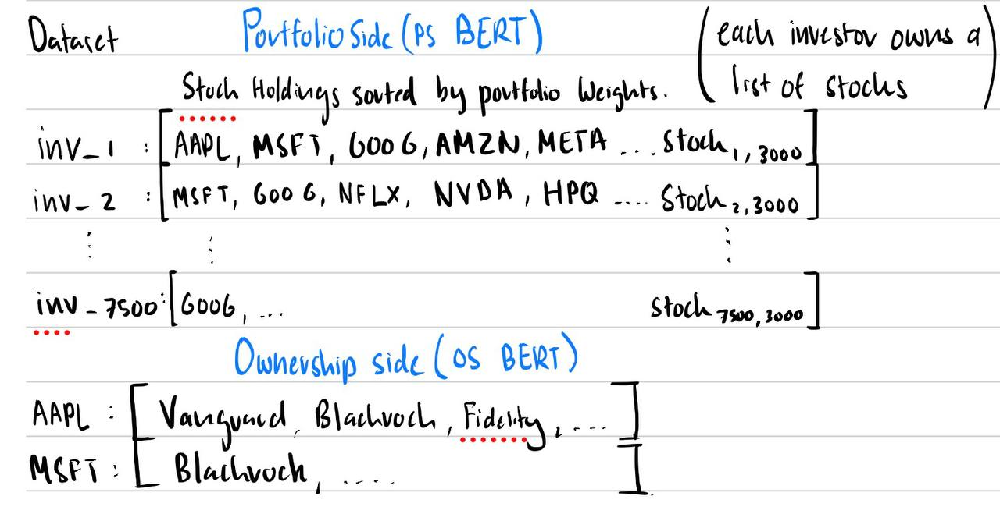

# What if we could understand a stock just by looking at who owns it?

When you want to understand what a stock is *really* about, the standard playbook is to look at fundamentals — earnings, revenue, sector, market cap, beta to the market. But there's another data source hiding in plain sight: **who owns the stock**.

If Vanguard, BlackRock, and Fidelity all hold both Apple and Microsoft in similar weights, those two stocks are probably "similar" in some meaningful way — not because their P/E ratios match, but because the same set of decision-makers chose to hold them together. That's a fundamentally different kind of signal.

This project, built as a group assignment for NUS FT5011 (Deep Learning for Finance), explores a recent paper by Gabaix, Koijen, Richmond & Yogo (2025) that tries to extract this signal at scale, using deep learning techniques originally developed for natural language processing.

## Borrowing an idea from language

If you've heard of Word2Vec, you already know the core intuition.

Word2Vec was a 2013 breakthrough that turned every word in English into a list of around 300 numbers — and it did so in a way where words that *appear in similar contexts* ended up close together in that 300-dimensional space. "King" and "queen" were neighbours. "Paris" and "Tokyo" were neighbours. You could even do arithmetic: `king - man + woman ≈ queen`.

The magic wasn't that someone hand-coded relationships between words. The magic was that the model **learned** these relationships purely by observing which words tend to co-occur in real text.

What if we did the same thing for stocks? Treat each investor's portfolio as a "sentence" of stocks. Stocks that tend to co-occur in portfolios are probably similar in some way the model can pick up — even if we never tell it anything about earnings or industries.

Concretely, the model sees the holdings data two ways — both feed BERT the same way Word2Vec ate sentences of words.

### Two views, two BERTs

The same data can be sliced two ways, and each slice trains a different BERT:

- **PS-BERT (Portfolio-Side)** — each *investor* is a sentence of the stocks they hold, sorted by portfolio weight. Two stocks end up with similar embeddings if they tend to be held *together* in portfolios.
- **OS-BERT (Ownership-Side)** — each *stock* is a sentence of the investors who hold it, sorted by ownership share. Two stocks end up with similar embeddings if they're held by the *same kinds* of investors.

Same architecture (a 4-layer, 2-head transformer trained with masked language modelling). Same objective. Only the input format changes. That sounds like a small choice, but it ends up determining which downstream questions each model is good at — a theme the rest of the post keeps coming back to.

Either way you slice it, the output is an asset embedding: a short list of numbers (we used 4 and 10) that summarises everything investors collectively think about a stock, just from observing who held it.

## The data

We used FactSet institutional holdings data covering 2005–2022:

- ~3,000 US stocks per quarter
- ~7,500 institutional investors per quarter (mutual funds, pensions, hedge funds)
- 72 quarterly snapshots

For each quarter we built a giant matrix: rows = investors, columns = stocks, values = how much each investor held. The whole project is about compressing each stock's column of that matrix into a small embedding.

From there we passed the holdings matrix through several encoders — BERT (in both PS and OS variants), a VAE, a GNN, and a Graph-VAE — each producing a 4- or 10-dimensional vector per stock.

## Five ways to compress

The original paper proposed three approaches: a recommender-system style matrix factorisation, Word2Vec, and a BERT-style transformer. We replicated those, then asked: can deep learning do better? We tried five extensions:

- **BERT v7** — fixed a bottleneck in the original BERT by decoupling its internal hidden dimension from the embedding dimension, giving the transformer more working memory. Trained as both PS-BERT v7 and OS-BERT v7. **OS-BERT v7 nearly 4× the paper's masked-investor score** (0.13 → 0.512).
- **Long-BERT (PS-side)** — doubled the context window from 64 to 128 tokens so each investor's portfolio sequence retains more context before truncation. Best result on the **portfolio-prediction benchmark (R\_MP = 0.346)**, beating the paper's ~0.30.
- **VAE** — works on each stock's full ownership profile (the OS view, but as a vector instead of a sequence). Compresses through a latent bottleneck with a reconstruction objective.
- **GNN (GraphSAGE)** — treats stocks as nodes in a co-holding graph (edge if ≥3 shared investors). Learns embeddings via link prediction.
- **Graph-VAE** — same GraphSAGE encoder but with the VAE's reconstruction objective replacing link prediction.

## The result that surprised us

Each model is a different combination of two choices: *what architecture* to use, and *what training objective* to optimise. The naïve assumption is that fancier architectures do better. They didn't. The pattern was much simpler:

> **The training objective matters more than the architecture.**

The clearest evidence: the plain GNN, trained to predict whether two stocks share investors, scored 0.06 on the portfolio-prediction benchmark. Pretty terrible. But Graph-VAE which has the same graph, same encoder, only the training objective changed to reconstruction — scored 0.28. A 5× improvement from one decision.

<!--  -->

Different tasks rewarded different objectives:

- For predicting **valuations** (R\_V), the simplest matrix factorisation (RS-L-Min, no neural network at all) won — because exact weight precision matters more than abstract structure.
- For **portfolio prediction** (R\_MP), Long-BERT won — a longer PS-side context window lets the model see more of each portfolio before the attention head dilutes.
- For **predicting masked investors** (R\_MI), OS-BERT v7 won — its training objective (predicting masked tokens) matched the evaluation task exactly.

No single model dominated everything. The lesson wasn't "use the biggest model." It was "match what you're optimising to what you actually want."

## What this means

For a finance audience, the practical takeaway is that institutional holdings data contains a surprising amount of stock-level information that traditional firm characteristics miss. We could explain over 50% of the cross-sectional variation in stock valuations using nothing but ownership patterns - no fundamentals, no macro factors. Which allow's us to deduce that there's a meaningful signal hiding in plain sight.

For a machine learning audience, it's a reminder that benchmark-chasing on fancier architectures can be a dead end. The biggest gains came from rethinking *what we were asking the model to learn*, not which model was doing the learning.

## What didn't work

Worth being honest: the plain GNN - our most architecturally novel idea, was our worst model. It captured graph structure beautifully, and graph structure turned out to not be what the benchmarks were actually testing.

Graph-VAE rescued the GNN encoder by repurposing it for a more useful task. But even Graph-VAE didn't beat the plain VAE that ignores the graph entirely. At our data scale, the ownership profile vector already encodes most of the relational information implicitly; an explicit graph is partially redundant. We'd expect the graph to start helping at larger scale or with sparser data.

## Closing

If you take one thing from this project, take this: in a world where everyone's grabbing the latest model, the leverage point usually isn't *which* model you use. It's whether you've correctly framed *what you're asking it to learn*.

---

**Code:** [github.com/notahotdog/FT5011-Group-Project](https://github.com/notahotdog/FT5011-Group-Project)

**Full report (PDF):** [Asset Embeddings — Replication and Novel Deep Learning Extensions](/ft5011_group_report.pdf)
